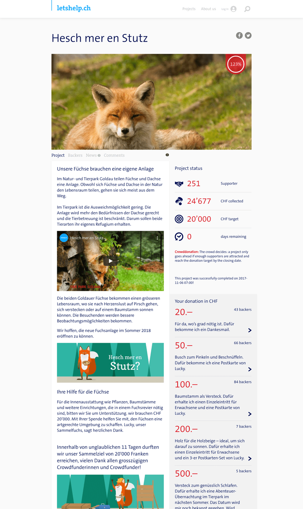

# Swisscom Crowdfunding

Swisscom crowdfunding marketplace letshelp.ch and Crowdfunding Platform as a service

<!--more-->

* Designed and implemented a white-label crowdfunding platform and marketplaces
* Planned and coordinated customization of white-label services
* Automated digital identification and signing product release process
* Set up and maintained CI/CD pipeline

## Technologies

* Ruby on Rails
* PostgreSQL
* RSpec
* Capybara
* Chromedriver
* Capistrano
* Jenkins

## Links

* <a href="https://www.swisscom.ch/de/about/news/2014/09/20140901-MM-Crowdfunding.html" target="_blank">Launch Press release</a>
* <a href="https://www.swisscom.ch/de/about/medien/infos-und-fakten/20180116-spendenplattform-letshelp-stellt-betrieb-ein.html" target="_blank">Shutdown notice</a>

## Screenshots

